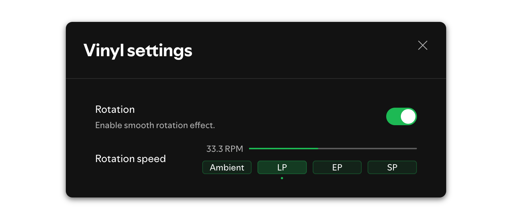
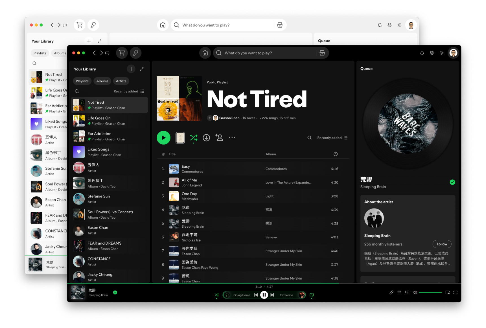
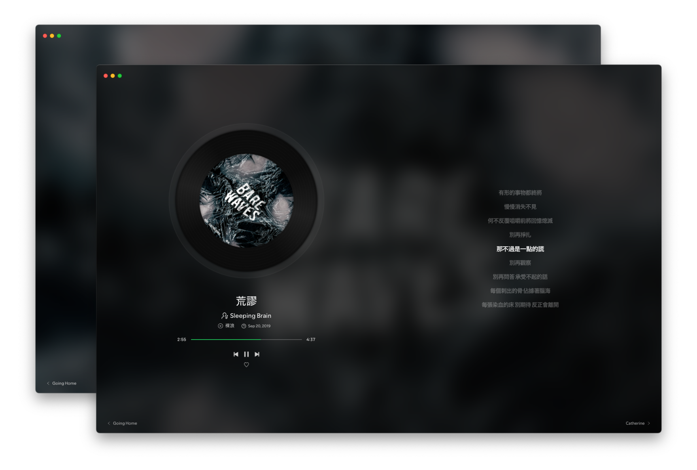

# Spotify Spice


Join [Discord](https://discord.gg/UK84KCbNf6) for discussions and support.

For bugs or improvements, please open an issue or PR. ❤️

## Compatibility

Latest version of [Spotify](https://www.spotify.com/) and [Spicetify](https://github.com/spicetify/cli).

_Looking for older versions? Download legacy versions from the [Releases](https://github.com/grasonchan/spotify-spice/releases) page._

## Installation

Use [Spicetify Marketplace](https://github.com/spicetify/marketplace) to install.

## Extensions

### Vinyl

Transforms the album artwork into a spinning, lightness-adaptive vinyl driven by your playback state.

Supports both the **Now Playing View** and [**Full App Display**](#optional).

Open the profile menu to access the vinyl settings.

_Tip: Keep vinyl in Now Playing View by turning off `Settings` → `Display` → `Display short, looping visuals on tracks (Canvas)`._




### Track Peek

Peek into tracks without switching playback.

Right-click any track to access the audio preview.


## Theme

A seamless extension of the native Spotify aesthetic, featuring a native-quality Light Mode alongside an optimized Dark Mode.




## Optional

enable Spicetify's built-in extensions and custom apps for the complete experience:

```shell
spicetify config extensions fullAppDisplay.js
spicetify config custom_apps lyrics-plus
spicetify apply
```
