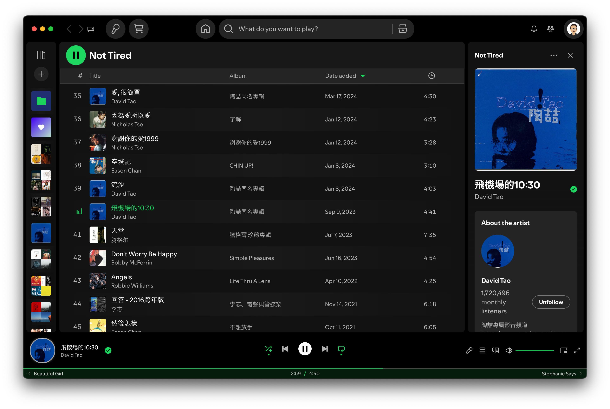
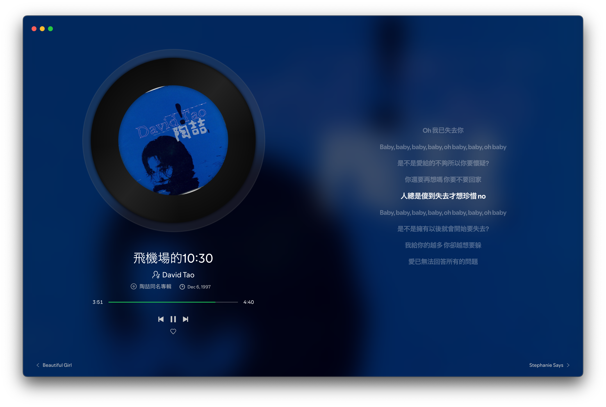

# Spotify Spice

Based on Spotify original theme. The design of turntable is inspired by [Netease Music](https://music.163.com) and [Smartisan OS build-in Music Player](https://www.smartisan.com/os/#/beauty).

If there's any problem, please open issue or PR. ❤️




## Dependencies

Latest version of [Spotify](https://www.spotify.com/) and [Spicetify](https://github.com/spicetify/cli).

## Installation

### Basic

clone the repository, follow the steps below:

```shell
cd spotify-spice
cp -r SpotifySpice <config-folder-path>/Themes

spicetify config current_theme SpotifySpice
spicetify config inject_theme_js 1

spicetify apply
```

#### Notes

Replace `<config-folder-path>` with your OS-specific path.

* Linux / macOS: `~/.config/spicetify/`
* Windows (Powershell): `$env:APPDATA/spicetify/`

### Optional

enable Spicetify's build-in extensions for a complete experience:

```shell
spicetify config extensions fullAppDisplay.js
spicetify config custom_apps lyrics-plus

spicetify apply
```

Once enabled, you can configure these extensions according to your preferences.
